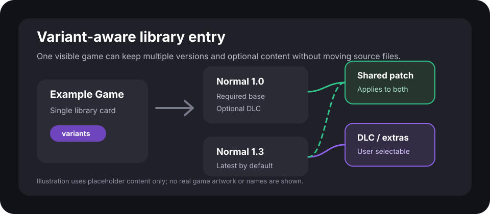
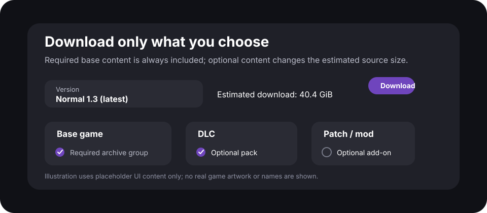

    

    <h2>Gameyfin</h2>
    <h4>Manage your video games.</h4>
    
simple / fast / <a href="https://gameyfin.org/blog/2025/12/22/why-gameyfin-is-foss/">FOSS</a>

## Overview

Name and functionality inspired by [Jellyfin](https://jellyfin.org/).

> [!IMPORTANT]
> This repository contains an unofficial Gameyfin build. It is not an upstream release and is not presented as endorsed
> by the Gameyfin maintainers. It exists to prototype variant/version support, selectable extra content, grouped archive
> downloads, hardlink-friendly library handling, and metadata tools for keeping torrent-managed paths in place.

Gameyfin will turn your disorganized collection of video games into a beautiful, easy-to-navigate library that you can
access from any device with a web browser.  
It will automatically scan your game folders, download metadata and cover images, and present everything in a
user-friendly interface.  
Download your game files directly from the web UI, share your library with friends, and enjoy your games like never
before.

### Documentation

The documentation and screenshots are available at [gameyfin.org](https://gameyfin.org/).

### Unofficial Variant Build

This fork adds experimental support for libraries where one visible game entry can contain multiple versions and
variants without moving the original source files.

Highlights:

* Version-aware variants, with the latest `Normal` version selected by default unless an admin pins another default.
* User-selectable DLC, patches, mods, extras, and dedicated server content per download.
* Shared optional content that can apply to multiple versions.
* Grouped content paths so multipart archives can appear as one selectable download item.
* Admin tools for attaching existing paths, grouping duplicates, and ignoring attached source paths so scans do not
  recreate duplicate games.
* Hardlink mirror storage mode for libraries that need managed access without breaking torrent paths.

The images below are neutral illustrations of the added behavior and intentionally do not show real game artwork.

    

    

### Features

✨ Automatically scans and indexes your game libraries  
⬇️ Access your library via your web browser & download games directly from there  
👥 Share your library with friends & family  
⚛️ LAN-friendly (everything is cached locally - except for videos)  
🐋 Runs in a container or any system with a JVM  
🌈 Themes (including colorblind support)  
🔌 Easily expandable with plugins  
🔒 Integrates into your SSO solution via OAuth2 / OpenID Connect  
🆓 **100% open source and free to use without any paywall.**

### Contribute to Gameyfin

Contributions are welcome!  
There are no strict requirements to contribute, but please contact us first if you want to implement a new feature or
change the design of the application before you start working on it.

### Technical Details

Gameyfin v2 is written in Kotlin and uses the following libraries/frameworks:

* Spring Boot 3 for the backend
* Vaadin Hilla & React for the frontend
* PF4J for the plugin system
* H2 database for persistence

### Acknowledgements

  
Gameyfin is supported by [YourKit](https://www.yourkit.com/), the makers
of [YourKit Java Profiler](https://yourkit.com/java/profiler/), a powerful tool for profiling Java and Kotlin
applications.
