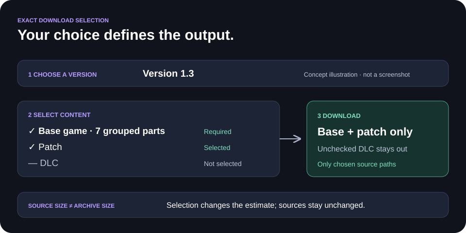
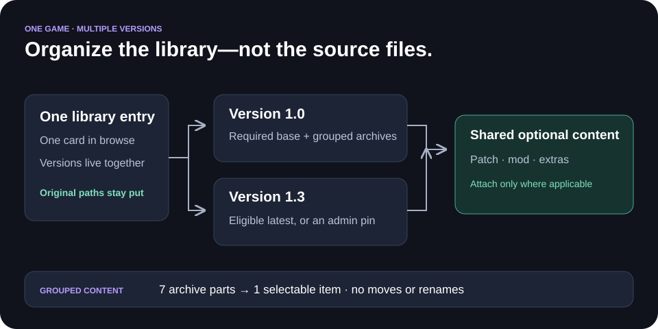

  

<h1 align="center">Gameyfin · Niborian fork</h1>

One library. Multiple versions. Exactly the files you choose.

  <a href="#features">Features</a> ·
  <a href="#getting-started">Setup</a> ·
  <a href="#development-status">Status</a> ·
  <a href="https://github.com/gameyfin/gameyfin">Upstream</a>

Gameyfin turns your game folders into a browsable library with metadata, artwork,
and downloads. This fork extends it for versioned libraries, grouped content,
and workflows that leave torrent-managed sources in place.

This is a **personal Niborian fork**, made primarily for my own game library and
workflow. Gameyfin itself is the work of the [original project and its contributors](https://github.com/gameyfin/gameyfin).
This fork is not intended to compete with, represent, or replace that project.

> [!IMPORTANT]
> This is an **unofficial, experimental fork**, not an upstream release.
> Report fork problems [here](https://github.com/Niborian/gameyfin/issues).
> Validate it against your own library before upgrading; passing CI does not
> guarantee production readiness. It is not endorsed by the original maintainers.

## Features

| Added by this fork | What it means |
| --- | --- |
| Versions and variants | Keep multiple releases under one game and pin a default. |
| Selectable content | Choose DLC, patches, mods, extras, and server files alongside the base game. |
| Grouped and shared paths | Treat multipart content as one selection; share optional content across versions. |
| Library curation | Attach existing paths, review classification, and ignore duplicate-producing paths. |
| Source-safe storage | Use managed hardlink mirrors without relocating original torrent paths. |
| Reviewed automation | Review Steam update signals and authorized acquisition requests before acting. |

  

Explore the variant and shared-content model

  

The foundation comes from [original Gameyfin](https://gameyfin.org/): library
indexing, metadata and artwork, browser downloads, themes, plugins, and optional
OIDC/OAuth2 sign-in. This fork builds on that work, rather than replacing its authors.

## Getting started

1. Read the [upstream documentation](https://gameyfin.org/) for general setup.
2. Adapt the fork's [Compose example](docker/docker-compose.example.yml) and
   [network exposure guide](docs/PORT-EXPOSURE.md) to your own paths, secrets, and proxy.
3. Validate a reviewed image against an isolated fixture or copy. See
   [staging validation](docs/STAGING-IMAGE-EVIDENCE.md); never mount writable production torrent sources.
4. Rehearse [backup and restore](docs/backup-restore-rehearsal.md), retain a rollback
   image, and review [cutover evidence](docs/CUTOVER-EVIDENCE.md) before switching.

Fork images use `ghcr.io/niborian/gameyfin`. Prefer a reviewed immutable digest for
repeatability. A newer version or `latest` alone is not proof of readiness.

### Deliberate releases

[build.gradle.kts](build.gradle.kts) defines the version synchronized with the UI.
PRs test and build without publishing a release. Candidate publication and
promotion are separate manual operations; ordinary merges **do not move `latest`**.
Promotion uses the reviewed existing digest, not a rebuild.

Check the [release workflow](.github/workflows/package.yml), image revision,
UI version, provenance, SBOM, and tag/digest identity before deployment.

## Library safety

- Scans, grouping, and retirement must not move, rename, delete, or rewrite torrent-managed sources.
- Classification and update suggestions are review evidence, not authority to replace or download content.
- Retirement archives versions first. Only eligible managed mirrors or caches may be cleaned up after review.
- Acquisition is disabled by default and requires deliberate approval, authorized content,
  approved indexers, and a dedicated isolated client. qBittorrent tags/categories are not credential permissions.

Read [retirement safeguards](docs/variant-retirement.md) and
[acquisition boundaries](docs/AUTHORIZED-ACQUISITION-PROVIDER.md).

## Development status

Implemented behavior and passing tests are not the same as production acceptance.
Follow the [issues](https://github.com/Niborian/gameyfin/issues) for remaining criteria.

| Workstream | Details |
| --- | --- |
| Release identity | [Release foundation](https://github.com/Niborian/gameyfin/milestone/1) |
| Rescan and variant integrity | [Library integrity](https://github.com/Niborian/gameyfin/milestone/2) |
| Exact versions and optional content | [Selectable downloads](https://github.com/Niborian/gameyfin/milestone/3) |
| Memory, recovery, backups and exposure | [Production operations](https://github.com/Niborian/gameyfin/milestone/4) · [Scan measurements](docs/SCAN-MEMORY.md) |
| Keeping up with upstream | [Compatibility](https://github.com/Niborian/gameyfin/milestone/5) · [Sync guide](docs/UPSTREAM-SYNC.md) |
| Classification and approved requests | [Library intelligence](https://github.com/Niborian/gameyfin/milestone/6) |

**In development:** optional qBittorrent-backed torrent distribution for exact
library selections ([#112](https://github.com/Niborian/gameyfin/issues/112)), separate
from acquisition. The original plugin remains available until replacement parity
is proven. No production replacement is implied.

## Contributing and credits

Keep PRs focused, linked to milestone-backed issues, and supported by tests or
acceptance evidence. Preserve source paths and distinguish fixture results from
production claims. Useful changes are available upstream under [AGPL-3.0](LICENSE.md);
coordinate upstream contributions with its maintainers. The original maintainers
are welcome to adopt useful changes from this fork under the same license.

Built with Kotlin, Spring Boot, Vaadin Hilla/React, PF4J, and H2. Inspired by
[Jellyfin](https://jellyfin.org/).

Thanks to the [Gameyfin contributors](https://github.com/gameyfin/gameyfin) and
[YourKit](https://www.yourkit.com/), whose Java profiler supports the upstream project.
